# 🔐 Tính năng Bật/Tắt Trang Welcome

## 📋 Tổng quan

Đã thêm tính năng quản trị để bật/tắt trang Welcome với bảo mật mật khẩu.

## ✨ Tính năng

### 1. **Toggle Switch trong Sidebar**
- 🎚️ Gạt bật/tắt trang Welcome
- 🔒 Yêu cầu mật khẩu: `Anhquan210706`
- 📍 Vị trí: Trong sidebar, phía trên nút "Đăng xuất"

### 2. **Logic hoạt động**

#### Khi BẬT Welcome (Mặc định):
```
✅ Logic như cũ:
- Truy cập localhost:3000 → Redirect về /welcome
- Chưa đăng nhập → /welcome
- Đã qua welcome → /login
- Đã đăng nhập → /dashboard
- Logout → /welcome
```

#### Khi TẮT Welcome:
```
⚡ Logic mới:
- Truy cập localhost:3000 → Redirect về /login
- Bất kỳ trang nào (chưa login) → /login
- Trang /welcome bị disable
- Đã đăng nhập → Cho phép truy cập các trang
- Logout → /login (KHÔNG về /welcome)
```

## 🏗️ Cấu trúc Code

### Files đã tạo mới:

1. **`app/settings/actions.ts`**
   - Server actions để lưu/đọc setting
   - Mật khẩu: `Anhquan210706`
   - Lưu trong cookie (httpOnly)

2. **`app/components/WelcomeToggle.tsx`**
   - Component toggle switch
   - Dialog nhập mật khẩu
   - Animation và feedback

3. **`components/ui/switch.tsx`**
   - Radix UI Switch component
   - Styling với Tailwind

### Files đã cập nhật:

1. **`app/components/SideBar.tsx`**
   - Thêm `WelcomeToggle` component
   - Props `welcomeEnabled`
   - Logic logout dựa vào setting

2. **`components/WelcomeGuard.tsx`**
   - Props `welcomeEnabled`
   - Logic redirect khác nhau khi tắt welcome

3. **`app/components/ClientLayout.tsx`**
   - Truyền `welcomeEnabled` xuống
   - Props chain

4. **`app/components/ClientSideBarWrapper.tsx`**
   - Nhận và truyền `welcomeEnabled`

5. **`app/components/ConditionalSideBar.tsx`**
   - Nhận và truyền `welcomeEnabled`

6. **`app/layout.tsx`**
   - Fetch `welcomeEnabled` từ server
   - Async function
   - Truyền xuống ClientLayout

## 🔑 Mật khẩu quản trị

```
Mật khẩu: Anhquan210706
```

⚠️ **Lưu ý bảo mật:**
- Mật khẩu được hardcode trong `app/settings/actions.ts`
- Server-side validation
- Setting lưu trong httpOnly cookie (an toàn hơn localStorage)
- Cookie có thời hạn 1 năm

## 🎨 UI/UX

### Toggle Switch Design:
- 🌈 Glass morphism style
- 🎯 Icon `ShieldCheck` màu xanh
- ✅ Hiển thị trạng thái: "Đang bật" / "Đang tắt"
- 🔄 Animation khi toggle

### Dialog mật khẩu:
- 🔐 Input type password
- ✅ Success message màu xanh
- ❌ Error message màu đỏ
- ⏳ Loading state
- 🎉 Auto close sau 1.5s khi thành công

## 📱 Responsive

- ✅ Mobile friendly
- ✅ Touch optimized
- ✅ Glassmorphism design
- ✅ Dark mode support

## 🧪 Testing

### Test case 1: Bật Welcome (mặc định)
1. Truy cập `localhost:3000`
2. Kiểm tra redirect về `/welcome` ✅
3. Đăng nhập
4. Logout
5. Kiểm tra redirect về `/welcome` ✅

### Test case 2: Tắt Welcome
1. Mở sidebar
2. Toggle switch "Trang Welcome"
3. Nhập mật khẩu: `Anhquan210706`
4. Xác nhận
5. Truy cập `localhost:3000`
6. Kiểm tra redirect về `/login` ✅
7. Đăng nhập
8. Logout
9. Kiểm tra redirect về `/login` (KHÔNG về /welcome) ✅

### Test case 3: Sai mật khẩu
1. Toggle switch
2. Nhập mật khẩu sai
3. Kiểm tra error message ✅
4. Setting không thay đổi ✅

## 🔄 Flow Chart

```mermaid
graph TD
    A[Truy cập App] --> B{Welcome Enabled?}
    B -->|Yes| C{Đã login?}
    B -->|No| D{Đã login?}
    
    C -->|Yes| E[Dashboard]
    C -->|No| F{Qua Welcome?}
    
    F -->|Yes| G[Login Page]
    F -->|No| H[Welcome Page]
    
    D -->|Yes| E
    D -->|No| G
    
    E --> I[Logout]
    I --> B
```



## 📦 Dependencies mới

```json
{
  "@radix-ui/react-switch": "^latest"
}
```

## 🚀 Deployment

Không cần thay đổi gì khi deploy:
- ✅ Server actions hoạt động trên Vercel
- ✅ Cookies được set đúng
- ✅ No environment variables needed
- ✅ Backward compatible (default: welcome enabled)

## 🔧 Customization

### Thay đổi mật khẩu:
File: `app/settings/actions.ts`
```typescript
const ADMIN_PASSWORD = "Anhquan210706"; // ← Thay đổi ở đây
```

### Thay đổi thời gian lưu cookie:
```typescript
maxAge: 60 * 60 * 24 * 365, // 1 year ← Thay đổi ở đây
```

### Thay đổi vị trí toggle:
File: `app/components/SideBar.tsx`
- Di chuyển `<WelcomeToggle />` đến vị trí khác trong SidebarFooter

## ⚠️ Lưu ý

1. **Mật khẩu hardcode**: Nên chuyển sang environment variable cho production
2. **Cookie security**: Đã dùng httpOnly và secure (production)
3. **Refresh required**: Sau khi toggle, trang sẽ tự refresh
4. **Logout behavior**: Phụ thuộc vào setting hiện tại

## 🎯 Kết quả

✅ Toggle switch hoạt động mượt mà
✅ Bảo mật với mật khẩu
✅ UI đẹp và responsive
✅ Logic redirect chính xác
✅ Cookie persistent (1 năm)
✅ Dark mode support
✅ Animation và feedback tốt
